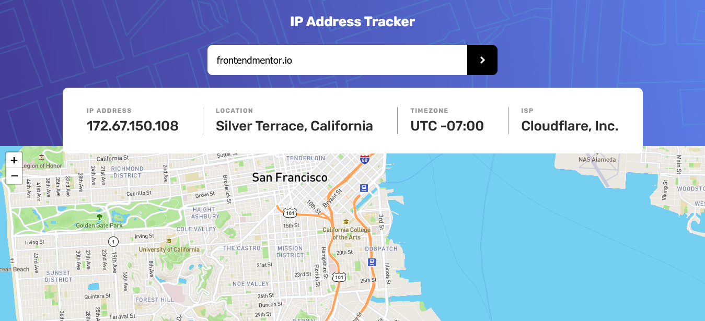

# Frontend Mentor - IP address tracker solution

This is a solution to the [IP address tracker challenge on Frontend Mentor](https://www.frontendmentor.io/challenges/ip-address-tracker-I8-0yYAH0). Frontend Mentor challenges help you improve your coding skills by building realistic projects.

## Table of contents

- [Frontend Mentor - IP address tracker solution](#frontend-mentor---ip-address-tracker-solution)
  - [Table of contents](#table-of-contents)
  - [Overview](#overview)
    - [The challenge](#the-challenge)
    - [Screenshot](#screenshot)
    - [Links](#links)
  - [My process](#my-process)
    - [Built with](#built-with)
    - [What I learned](#what-i-learned)
    - [Continued development](#continued-development)
    - [Useful resources](#useful-resources)
  - [Author](#author)

## Overview

### The challenge

Users should be able to:

- View the optimal layout for each page depending on their device's screen size
- See hover states for all interactive elements on the page
- See their own IP address on the map on the initial page load
- Search for any IP addresses or domains and see the key information and location
- As an extra challenge - make the infomation card collapse when clicked.

### Screenshot



### Links

- Solution URL: [Add solution URL here](https://www.frontendmentor.io/solutions/ip-address-tracker-wdNpQaW_e)
- Live Site URL: [Add live site URL here](https://jsweeney-ip-address-tracker.netlify.app)

## My process

### Built with

- HTML
- CSS
- JavaScript

### What I learned

This was my first real challenge using an API. Some notes:

- Create a file to simulate the data that comes from the API. That way, while testing, you don't have to continually call the API.
- Stored `userInput` as an object in order to give it a "value" and "type". Assigned type based on some regex matching. I then generated the URL to fetch data with a ternary operator.

```js
let userInput = {
  value: document.getElementById("ip-domain-user-input").value,
  type: null,
};
if (userInput.value.match(/\d*\.\d*\.\d*\.\d*/)) {
  userInput.type = "ipAddress";
} else {
  userInput.type = "domain";
}

// if no user input => get default API value (which uses user's IP address as a default)
const url = userInput.value
  ? `https://geo.ipify.org/api/v1?apiKey=at_buolCeBWmSm37OCUs5M7VfDn6RD38&${userInput.type}=${userInput.value}`
  : "https://geo.ipify.org/api/v1?apiKey=at_buolCeBWmSm37OCUs5M7VfDn6RD38";
```

- The leaflet.js map API was a bit tricky to figure out.
  - One issue I had was getting other elements to overlap with map. I realized that the map had z-index layers that were high (like in the 500s) by default. So To overlap those layers, I had to set the z-index of the overlapping element to something like 999.
  - Another issue I was running into was getting this error: "Map container is already initialized". This [stackoverflow post helped](https://stackoverflow.com/questions/19186428/refresh-leaflet-map-map-container-is-already-initialized). Interstingly, I couldn't find anything in the leaflet docs about this but I figured out how to deal with it. I had to declare map as a global variable with `let mymap = L.map("mapid")`. Then, anytime I rendered a map I had to first do `mymap.off()` and `mymap.remove()`. This uninitialized the map so that I could create a new one (I think that's what is happening anyway).

### Continued development

I could probably handle errors a bit more specifically. I'm only catching if the user enters in something that isn't an IP address or a domain.

I built this with Vanilla JavaScript. This is the most I've done with Vanilla JS on a project. It was a good learning experience but I'm finding that I like React a lot more.

### Useful resources

- [Traversy Media - Callbacks, Promises, Async/Await](https://www.youtube.com/watch?v=PoRJizFvM7s) - Helped me understand how to create async functions.
- https://stackoverflow.com/questions/19186428/refresh-leaflet-map-map-container-is-already-initialized

## Author

- Website - [Jimmy Sweeney](https://jimmysweeney.page)
- Frontend Mentor - [@sweenejp](https://www.frontendmentor.io/profile/sweenejp)
